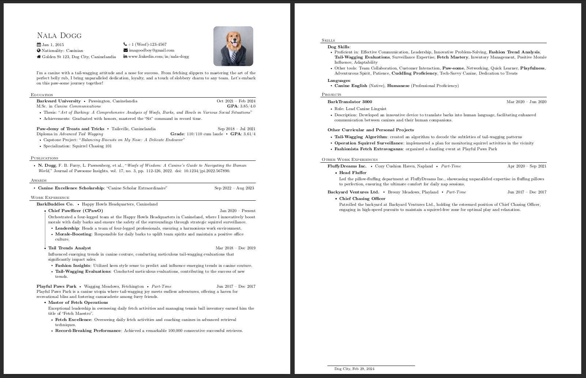

# Professional CV Template 🤵🏻

A customizable and professional curriculum vitae (CV) template for the European market that I created based on various templates from different authors.




## Features:

- Clean and modern design
- Easy to customize
- Sections for personal information, education, experience, skills, and more

## Credits:

- **[Ganesh Mohan](https://github.com/ganesh2shiv)**: [Resume Latex Template](https://github.com/ganesh2shiv/resume-latex-template) - Original template on which this template is based
- **[Nox](https://tex.stackexchange.com/users/97512/nox)**: [Bullet List With Vertical Lines](https://tex.stackexchange.com/a/454759) - Original code for generating bullet list with vertical connecting lines

Feel free to use and modify this template to suit your needs. If you find it helpful, consider giving it a star! ⭐

## Usage:

1. Clone the repository:
   ```bash
   git clone https://github.com/amark999/cv-template.git
   ```
2. Customize the `main.tex` file with your information.
3. Compile the LaTeX file to generate your CV.

## License:

This project is licensed under the MIT License, so feel free to use and modify it as needed.

---

If you have any suggestions, improvements, or bug reports, please open an issue or create a pull request. I appreciate your contributions!
